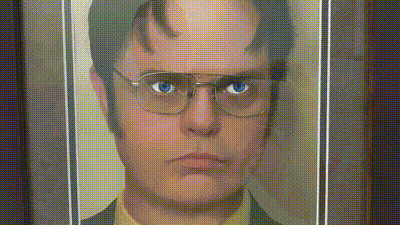

# dwight-schrute

This is Arduino code that I used to create a picture where the eyes move when it detects movement.

I ended up using a Lolin D1 mini, because it was small and I had one sitting around.

The microwave sensor maps to pin D2 and the servo maps to pin D6.

